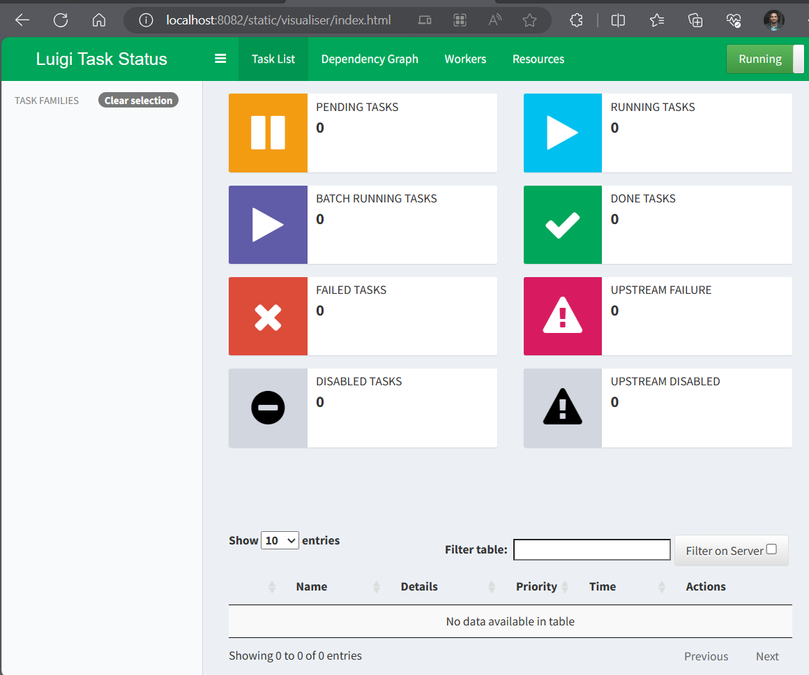

# luigi_wsl
//wsl$ 

Step 1 — Setup - luigi on Ubuntu WSL Windows

https://www.digitalocean.com/community/tutorials/how-to-install-python-3-and-set-up-a-programming-environment-on-an-ubuntu-20-04-server

hp-desk-ak-lx@hp-desk-ak:~/lnx_git/luigi_ubntu_wsl$ sudo apt update
hp-desk-ak-lx@hp-desk-ak:~/lnx_git/luigi_ubntu_wsl$ sudo apt -y up
hp-desk-ak-lx@hp-desk-ak:~/lnx_git/luigi_ubntu_wsl$ python3 -V
Python 3.10.12

Now luigi install
https://www.digitalocean.com/community/tutorials/how-to-build-a-data-processing-pipeline-using-luigi-in-python-on-ubuntu-20-04

hp-desk-ak-lx@hp-desk-ak:~/lnx_git/luigi_ubntu_wsl$ sudo apt install python3.10-venv
hp-desk-ak-lx@hp-desk-ak:~/lnx_git/luigi_ubntu_wsl$ python3 -m venv luigi-venv
hp-desk-ak-lx@hp-desk-ak:~/lnx_git/luigi_ubntu_wsl$ . luigi-venv/bin/activate
(luigi-venv) hp-desk-ak-lx@hp-desk-ak:~/lnx_git/luigi_ubntu_wsl$ pip install wheel luigi beautifulsoup4 requests

Step 2 — Creating a Luigi Task

create helloWorld.py

#run as temp local-scheduler
(luigi-venv) hp-desk-ak-lx@hp-desk-ak:~/lnx_git/luigi_ubntu_wsl$ python -m luigi --module hello-world HelloLuigi --local-scheduler

Step 3 — Creating a Task to Extract a List of Books

In this step, you will create a Luigi task and define a run() method for the task to download a list of the most popular books on Project Gutenberg. You’ll define an output() method to store links to these books in a file. You will run these using the Luigi local scheduler.

Create a new directory data inside of your luigi-demo directory. This will be where you will store the files defined in the output() methods of your tasks. You need to create the directories before running your tasks—Python throws exceptions when you try to write a file to a directory that does not exist yet:

(luigi-venv) hp-desk-ak-lx@hp-desk-ak:~/lnx_git/luigi_ubntu_wsl$ mkdir data
(luigi-venv) hp-desk-ak-lx@hp-desk-ak:~/lnx_git/luigi_ubntu_wsl$ mkdir data/counts
(luigi-venv) hp-desk-ak-lx@hp-desk-ak:~/lnx_git/luigi_ubntu_wsl$ mkdir data/downloads

create word-frequency.py

#run as temp local-scheduler
(luigi-venv) hp-desk-ak-lx@hp-desk-ak:~/lnx_git/luigi_ubntu_wsl$ python -m luigi --module word-frequency GetTopBooks --local-scheduler

Step 4 — Running the Luigi Scheduler

(luigi-venv) hp-desk-ak-lx@hp-desk-ak:~/lnx_git/luigi_ubntu_wsl$ sudo ufw allow 8082/tcp
[sudo] password for hp-desk-ak-lx: 
Skipping adding existing rule
Skipping adding existing rule (v6)

To run the scheduler execute the following command:
(luigi-venv) hp-desk-ak-lx@hp-desk-ak:~/lnx_git/luigi_ubntu_wsl$ sudo sh -c ". luigi-venv/bin/activate ;luigid --background --port 8082"

if you get error port allready in use --> OSError: [Errno 98] Address already in use

(luigi-venv) hp-desk-ak-lx@hp-desk-ak:~/lnx_git/luigi_ubntu_wsl$ sudo lsof -i :8082  #this will tell which PID is using port, later you can kill it
(luigi-venv) hp-desk-ak-lx@hp-desk-ak:~/lnx_git/luigi_ubntu_wsl$ sudo fuser -k 8082/tcp
8082/tcp:            20370
(luigi-venv) hp-desk-ak-lx@hp-desk-ak:~/lnx_git/luigi_ubntu_wsl$ sudo lsof -i :808  #running this will return empty now

(luigi-venv) hp-desk-ak-lx@hp-desk-ak:~/lnx_git/luigi_ubntu_wsl$ sudo sh -c ". luigi-venv/bin/activate ;luigid --background --port 8082"
http://localhost:8082/static/visualiser/index.html

Step 4 — Running the Luigi Scheduler

